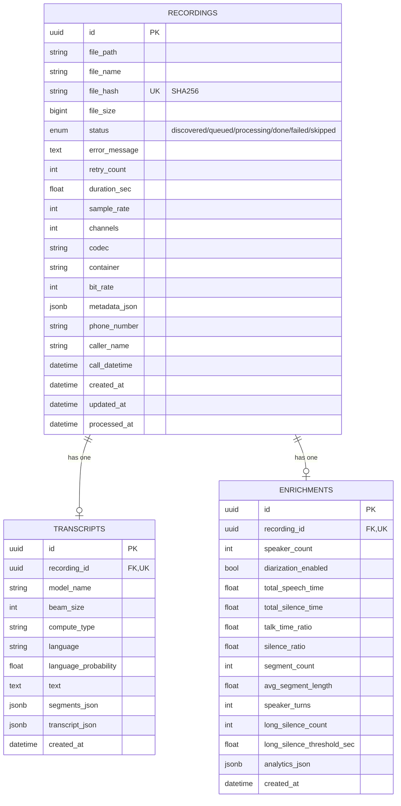

# Database Schema Diagram

This document describes the database structure for the Whisper transcription pipeline.

## Entity Relationship Diagram



## Table Descriptions

### `recordings`
The central table storing information about discovered audio files from the `Calls/` folder.

| Column Group | Fields | Description |
|--------------|--------|-------------|
| **Identity** | `id`, `file_path`, `file_name`, `file_hash` | Unique identifiers. `file_hash` (SHA256) ensures no duplicate files. |
| **Status** | `status`, `error_message`, `retry_count` | Pipeline processing state (discovered → queued → processing → done/failed/skipped). |
| **Audio Metadata** | `duration_sec`, `sample_rate`, `channels`, `codec`, `container`, `bit_rate` | Technical info extracted via ffprobe. |
| **Caller Info** | `phone_number`, `caller_name`, `call_datetime` | Parsed from filename pattern. |
| **Timestamps** | `created_at`, `updated_at`, `processed_at` | Audit trail for the record lifecycle. |

### `transcripts`
Stores the Whisper transcription output for each recording (1:1 relationship).

| Column Group | Fields | Description |
|--------------|--------|-------------|
| **Model Config** | `model_name`, `beam_size`, `compute_type` | Whisper model parameters used. |
| **Result** | `language`, `language_probability`, `text` | Detected language and full transcription text. |
| **Segments** | `segments_json` | JSON array of timed segments with optional speaker labels. |
| **Debug** | `transcript_json` | Raw Whisper output for debugging/reprocessing. |

### `enrichments`
Stores analytics and enrichment data computed from the transcription (1:1 relationship).

| Column Group | Fields | Description |
|--------------|--------|-------------|
| **Diarization** | `speaker_count`, `diarization_enabled` | Speaker identification info. |
| **Talk Analytics** | `total_speech_time`, `total_silence_time`, `talk_time_ratio`, `silence_ratio` | Speech vs silence metrics. |
| **Segments** | `segment_count`, `avg_segment_length`, `speaker_turns` | Conversation flow metrics. |
| **Silence Events** | `long_silence_count`, `long_silence_threshold_sec` | Long pause detection. |
| **Full Analytics** | `analytics_json` | Complete analytics payload as JSON. |

## Processing Pipeline Flow

```
┌─────────────────────────────────────────────────────────────────────────────┐
│                           PROCESSING PIPELINE                                │
├─────────────────────────────────────────────────────────────────────────────┤
│                                                                             │
│   ┌──────────┐      ┌──────────┐      ┌────────────┐      ┌───────────┐    │
│   │  Calls/  │─────▶│  Folder  │─────▶│  Celery    │─────▶│  Whisper  │    │
│   │  Folder  │      │  Watcher │      │  Worker    │      │  Model    │    │
│   └──────────┘      └────┬─────┘      └─────┬──────┘      └─────┬─────┘    │
│                          │                  │                    │          │
│                          ▼                  ▼                    ▼          │
│                    ┌──────────┐       ┌──────────┐        ┌──────────┐     │
│                    │recordings│◀──────│recordings│◀───────│transcripts│    │
│                    │(DISCOVERED)      │(PROCESSING)       │enrichments│    │
│                    └──────────┘       └──────────┘        └──────────┘     │
│                                                                             │
└─────────────────────────────────────────────────────────────────────────────┘
```

## Status State Machine

```
                              ┌──────────────┐
                              │  DISCOVERED  │
                              └──────┬───────┘
                                     │
                                     ▼
                              ┌──────────────┐
                              │    QUEUED    │
                              └──────┬───────┘
                                     │
                                     ▼
                              ┌──────────────┐
                              │  PROCESSING  │
                              └──────┬───────┘
                                     │
                    ┌────────────────┼────────────────┐
                    │                │                │
                    ▼                ▼                ▼
             ┌──────────┐     ┌──────────┐     ┌──────────┐
             │   DONE   │     │  FAILED  │     │  SKIPPED │
             └──────────┘     └──────────┘     └──────────┘
```

## Indexes

| Table | Indexed Columns | Purpose |
|-------|-----------------|---------|
| `recordings` | `file_path` | Quick lookup by file location |
| `recordings` | `file_hash` (unique) | Prevent duplicate processing |
| `recordings` | `status` | Filter recordings by pipeline stage |
| `recordings` | `phone_number` | Search calls by phone number |
| `transcripts` | `recording_id` (unique) | FK constraint, 1:1 relationship |
| `enrichments` | `recording_id` (unique) | FK constraint, 1:1 relationship |

## Cascade Behavior

- Deleting a `Recording` automatically deletes its associated `Transcript` and `Enrichment` records (`ON DELETE CASCADE`).
